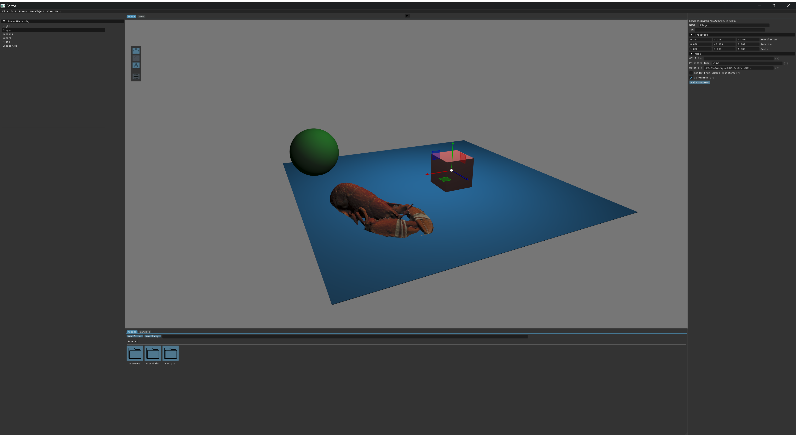
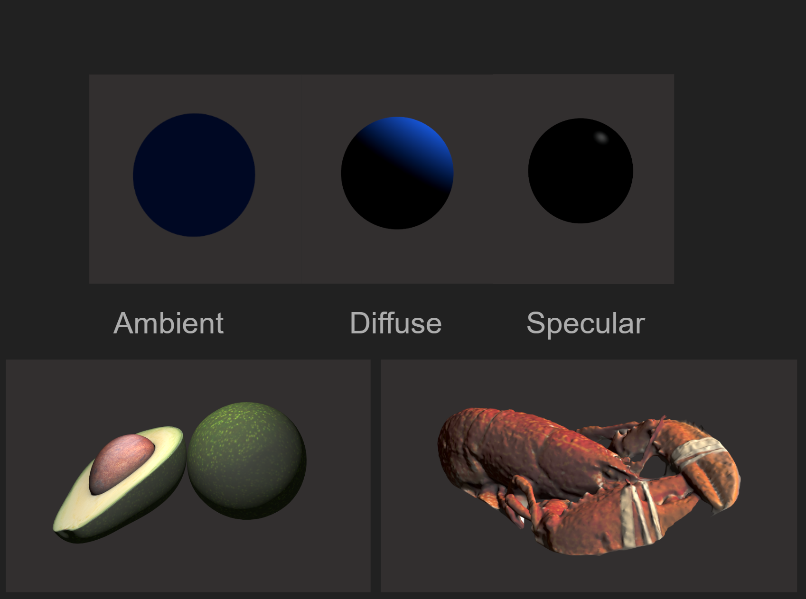
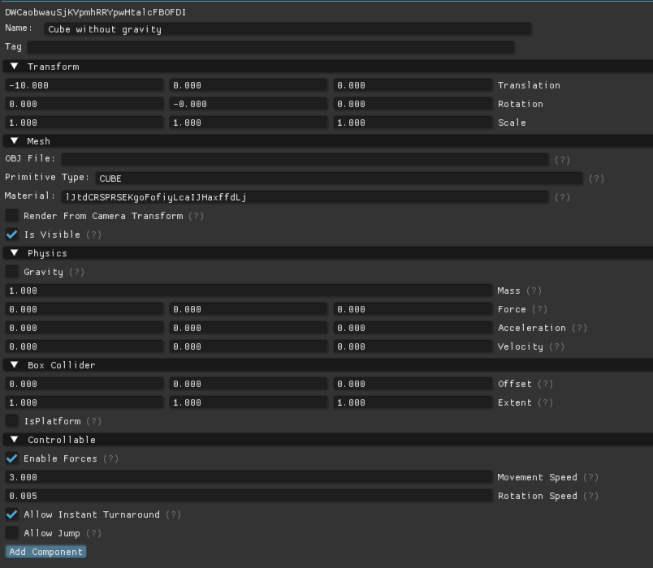

# LIDL Engine
A custom game engine written in C++, as part of the course *TDA572 Game engine architecture* at Chalmers. It draws inspiration from the Unity game engine, which we all had prior experience with through [our bachelor's thesis project](https://github.com/marc7s/TrafficSimulator). It features a game editor allowing you to create games from within the editor, which then integrates with the game engine allowing you to play your games.



## Features

### 3D Graphics


Our game engine implements 3D graphics using OpenGL, allowing you to create games in a 3D environment. It also has support for Blinn-Phong shading for improved realism. On the topic of shading, you also have the ability to add point lights or spotlights to your game to achieve the look you are after. This is essential in one of the games we created, where we wanted a horror type setting which meant reducing the lights and adding a spotlight in the form of a flashlight, casting shadows over the environment.

### Entity Component System
Our game engine is based around the entity component system, which as a simplified explanation is the idea that your objects are entities, which can have zero or more components. These components determine the behaviour of that object, allowing you to implement behaviours in components which can then be shared between any entities you like. A good example is creating a player and a platform. Both should have colliders, so you add collider components to them both. However, the player should interact with the physics engine allowing you to move around or jump, whereas the platform should not. So you add a physics component to only the player. Using the entity component system, you have a lot of flexibility for configuring your objects and sharing functionality, while not having to implement a collider for every type of object that should have one for example. Below is an example of a cube with several components - a mesh component to render the cube, a physics component allowing it to integrate with the physics engine and a controllable component allowing the player to control it. As you can see, each component has configurable settings, allowing us to deactivate gravity for this cube specifically, while other entities with it enabled can still be affected by gravity.



### Game Editor
Probably the biggest feature of our game engine is the addition of a game editor, allowing you to create games through a graphical user interface rather than having to write it fully in code and integrate it with the engine. Instead, the game editor offers the possibility to create GameObjects, adding materials and changing properties to build your environment. It also decouples us from C++, which the engine is written in, and offers support for scriptable components in Lua or C#. More on that in [the dedicated section](#scriptable-components).

### Physics Engine


The physics engine is the heart of any movement in the editor or games in our engine, and is notoriously one of the hardest things to get right. All physics engines are a simplification of reality and can be anything from simple translations to fully fledged engines used in simulations, so we decided to implement our own to support the features we needed. The physics engine is the brain behind moving the cameras around, enabling GameObjects to move, be affected by gravity or friction, or be controlled by the player among others. The physics engine can be customized, meaning you can create very different feeling games simply by changing the way physics work. You could for example disable forces, allowing objects to instantly change directions or changing the strength of gravity.

#### Colliders


One of our components is the `ColliderComponent`, of which we have two simple versions - the `BoxCollider` and the `SphereCollider`. You can see examples of both in the gif above. One thing you might notice is the drawn spheres and boxes - these are the colliders. Each collider also has an Axis Aligned Bounding Box, or AABB for short. This is used for efficient collision detection, as no matter how complex the collider might be you will only need to detect collisions between two AABBs - at first. If there is no collision between their AABBs, then you can move on to the next check. However, if they do collide then you need to run the actual collision detection code, which can be significantly more costly depending on the two colliders. This is why you see an AABB around the sphere collider above for efficient use in those rough checks, although collisions are against the spherical collider.

Colliders are integrated with the physics engine, which checks for collisions each time it updates and alerts any colliders that have subscribed to collision information - so that you can run code upon collision in your game. There is also support for ray collisions which is used behind the scenes, for example allowing you to select GameObjects in the scene by clicking on them.

#### Collision Resolution


Another thing the Physics Engine is responsible for, is handling collisions once they occur. One of the simplest collision resolution methods is simply reflecting the objects, like you would see in Pong for example. However, we wanted a more realistic approach so collision resolution in our engine has several possibilities. Collisions between an object and a non-physics based object results in reflection, but if both objects are physics based then there are two options. The first is perfectly elastic collisions, where both kinetic energy and momentum are conserved. The resulting velocities after the collision are determined based on their initial velocities as well as their mass - a heavy object will push light objects away. However, you could change the configuration of the physics engine. The second option is perfectly inelastic collisions, where the momentum is still preserved but the maximum amount of kinetic energy is lost. This will lead to both the objects having a shared velocity after the hit - sticking together. You can see an example of this below:


### Serialization
One thing that was required for many of our other features to be possible is serialization, through which we can save and restore states from. This is used in the editor for saving your game so you can open it at a later time and continue where you left off. It is also used when entering Play mode, serializing the current state so that you can play around with the game and when exiting back to scene view the game will be restored to its previous state. We also serialize editor settings, which allowed us to have our editors configured differently between developers. Finally, serialization is how we enable multiplayer support, saving the game state of certain multiplayer objects, before sending that information over to other connected clients which deserialize it and update their state accordingly.

### Scriptable components


By developing games through our editor, you do not need to know how the game engine behind it works, or even C++ that it is developed in. However, you can only do so much with the components and settings you have. For creating custom games, you almost always need some type of logic specific to that games, and so we need to provide that possibility to developers. Therefore, we added support for scriptable components, allowing you to create custom logic as components, and add those components to your GameObjects. You can write your scriptable components either in C# or Lua, and it offers hot reloads meaning you do not need to close the editor. You can simply update your scripts, and the editor will run the new version. It even displays compilation errors if you accidentally introduce any bad code. In the example above, you can see a simple scriptable component being developed, affecting the way the game behaves. After a code change, the cube repositioning is slowed down which you can see in the game the second time it is opened after the change in the scriptable component.

### Input System
The game engine features an input system allowing you to handle player input, both through games written directly in C++ but also through the scripts, allowing the player to interact with the game. There is also support for actions, so you can subscribe to a key combination or label actions - meaning you can easily swap the key bindings at a later date without needing to change the code. As an example, this is how we bind actions in the game editor, for example allowing you to copy GameObjects:
```C++
ActionMap::getInstance().addAction("Copy", { Key::LCTRL, Key::C });
```

### Multiplayer


The game engine offers built in support for creating multiplayer games, using a server-client model where the server acts as the middle man, relaying game states between the clients. It uses a socket implementation, with the server being written in C# while the clients use a multithreaded C++ implementation to send and receive data from the server. As a developer, you can select which GameObjects should be multiplayer enabled, avoiding sending uneeded data between the clients - such as game states for static environment objects. In the example above, you can see how controlling the player in the left hand game moves it in the right hand game, and vice versa. We also have a simple implementation of client side predictions, trying to predict the movement of external objects between the updates which is exemplified below where the update rate has been reduced significantly to simulate a bad connection. You can see this in action below, where the local client is the left one, with the right one receiving updates from the left game sporadically, but trying to predict the movement in between updates based on the latest state to interpolate between each update.


## Games

### Snake 3D


This is a game written directly in C++ and integrates directly with the game engine. It is a version of the classic game Snake, but in 3D and with continous movements. It uses custom physics engine settings in order to mimic a Snake-like movement feel.

### FPS Game


FPS Game is developed entirely through the game editor, using scriptable components for the game logic. It is set in a foggy forest, where your goal is to stop the invaders disguised as juice cartons.


## Setup
1. Clone the repository with `git clone --recurse-submodules https://github.com/hannes44/LIDL-Engine.git`
2. Install [CMake](https://cmake.org/download/)
3. Run cmake at the top folder layer. For example: `cmake -G "Visual Studio 17 2022" -A x64 -S . -B build`
4. Go to the generated build folder and open `GameEngine.sln` in Visual Studio 2022
5. Right click either `Editor`, `Game` or `Game2` depending on what you want to run in the Solution explorer and select `Set as Startup Project`
6. Go to `Tools -> Options -> Text Editor -> Code Cleanup` and enable `Run Code Cleanup profile on Save`
7. Select `Configure Code Cleanup` and add `Format document (C++)` to the profile under `Included fixers`
